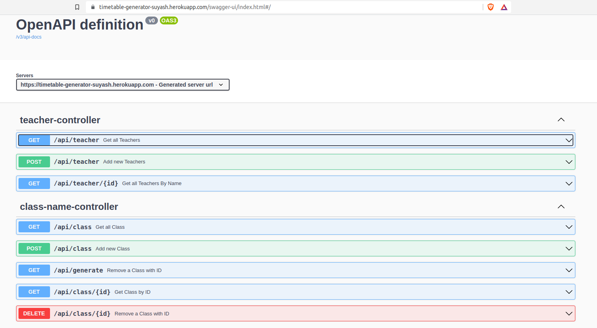
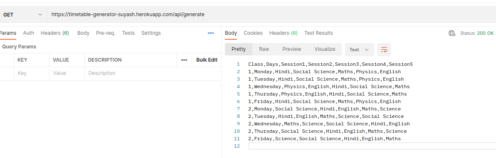
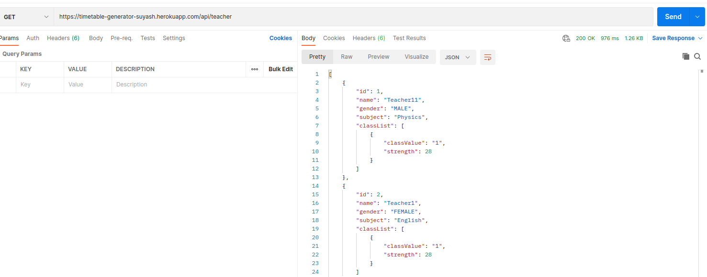
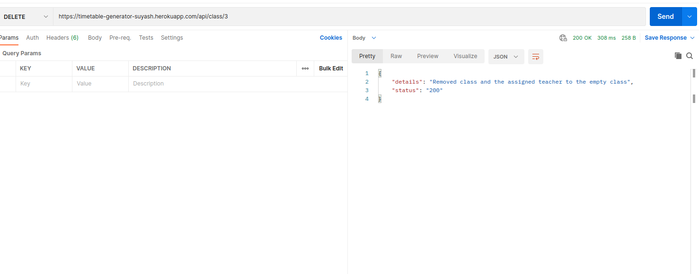
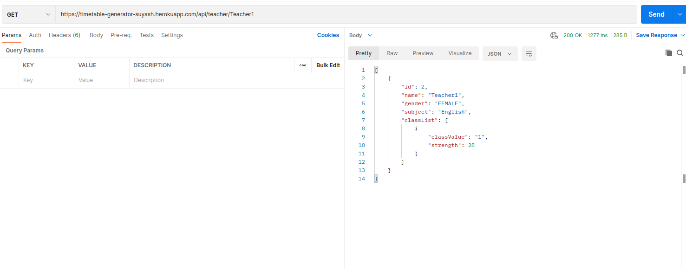

# Time Table generator

This app generates csv file time-table for each class with assigned teachers.
## Deployed on heroku server: [LINK](https://timetable-generator-suyash.herokuapp.com/)
## Documentation: [Swagger](https://timetable-generator-suyash.herokuapp.com/swagger-ui/index.html#/)

## Class : 

This entity contains data on each class.

## Teacher :

This entity contains data on teacher.

**NOTE:** one to many mapping from class to Teacher

## SCRENSHOTS:

